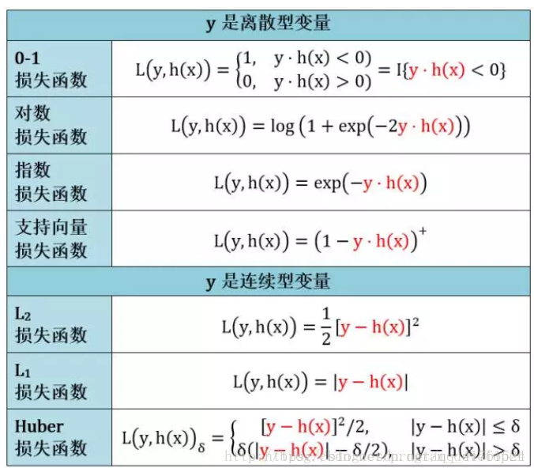

# 损失函数总结

## 0x1 概念解析

损失函数（Loss Function ）是定义在**单个样本**上的，算的是一个样本的误差。

代价函数（Cost Function ）是定义在**整个训练集**上的，是所有样本误差的平均，也就是损失函数的平均。有时候大家将代价函数和损失函数等价。

目标函数（Object Function）定义为：最终需要优化的函数。等于经验风险+结构风险（也就是**Cost Function + 正则化项**）。**经验损失函数反映的是预测结果和实际结果之间的差别**，**结构风险损失函数则是经验风险损失函数加上的正则项**(L0、L1（Lasso）、L2（Ridge）)。

风险函数（Risk Function）是损失函数的期望。

通常而言：目标函数是最大化或者最小化，而代价函数是最小化

我们最终的优化函数（目标函数）是：
$$
\theta ^*=arg \mathop{min}\limits_{\theta} \frac{1}{N}\sum_{i=1}^NL(y_i,f(x_i;\theta))+\lambda\Phi(\theta)
$$
也即是最优化经验风险加结构风险

代价函数的性质：

1. 对每种算法，代价函数不唯一
2. 代价函数是参数的函数
3. 总的代价函数可以用来评价模型的好坏
4. 代价函数是一个标量

## 0x2 log对数损失函数（逻辑回归）

log损失函数的标准形式：
$$
L(Y,P(Y|X))=-logP(Y|X)
$$
在逻辑回归的推导中，它假设样本服从伯努利分布（0-1分布），然后求得满足该分布的似然函数，接着取对数求极值

把极大化当做是一种思想，进而推导出它的经验风险函数为：最小化负的似然函数。从损失函数的视角来看，它就成了log损失函数

取对数是为了方便计算极大似然估计，因为在MLE中，直接求导比较困难，所以通常都是先取对数再求导找极值点。损失函数L(Y, P(Y|X))表达的是样本X在分类Y的情况下，使概率P(Y|X)达到最大值（换言之，就是利用已知的样本分布，找到最有可能（即最大概率）导致这种分布的参数值；或者说什么样的参数才能使我们观测到目前这组数据的概率最大）。因为log函数是单调递增的，所以logP(Y|X)也会达到最大值

因此在前面加上负号之后，就等价于最小化损失函数了

交叉熵刻画两个概率分布之间的距离。

## 0x3 平方损失函数（最小二乘法，Ordinary Least Squares）

最小二乘的基本原则是：最优拟合直线应该是使各点到回归直线的距离和最小的直线，即平方和最小。

换言之，OLS是基于距离的，而这个距离就是我们用的最多的**欧几里得距离** 

为什么它会选择使用欧式距离作为误差度量呢（即**Mean squared error， MSE**），主要有以下几个原因：

* 简单，计算方便；

* 欧氏距离是一种很好的相似性度量标准；

* 在不同的表示域变换后特征性质不变。

平方损失（Square loss）的标准形式如下：

$$
L(Y,f(X)) = (Y-f(X))^2
$$
当样本个数为N时，此时的损失函数变为：
$$
L(Y,f(X))=\frac{1}{N}\sum_{i=1}^N(Y-f(X))^2
$$
Y-f(X)表示的是残差，整个式子表示的是残差的平方和，而我们的目的就是最小化这个目标函数值（注：该式子未加入正则项），也就是最小化残差的平方和（residual sum of squares，RSS）。

而在实际应用中，通常会使用均方差（MSE）作为一项衡量指标，公式如下：

$$
MSE=\frac{1}{N}\sum_{i=1}^N(\tilde{Y_i}-f(X_i))^2
$$

## 0x4 指数损失（Adaboost）

常用在Adaboost之中

在Adaboost中，经过m此迭代之后，可以得到fm(x):

$$
f_m(x)=f_{m-1}(x)+\alpha_mG_m(x)
$$
Adaboost每次迭代时的目的是为了找到最小化下列式子时的参数α 和G：

$$
arg \mathop{min}\limits_{\alpha,G}=\sum_{i=1}^Nexp[-y_i(f_{m-1}(x_i))+\alpha G(x_i)]
$$
而指数损失函数(exp-loss）的标准形式如下
$$
L(y,f(X))=exp[-yf(x)]
$$
可以看出，Adaboost的目标式子就是指数损失，在给定n个样本的情况下，Adaboost的损失函数为：

$$
L(y,f(X))=\frac{1}{N}\sum_{i=1}^Nexp[-y_if(x_i)]
$$

## 0x5  Hinge函数损失（SVM）

Hinge 损失函数的标准形式
$$
L(y)=max(0,1-y\tilde{y}）,y=\pm1
$$
^为预测值，在-1到1之间，y为目标值（-1或1）

 

## 其它损失函数

除了以上这几种损失函数，常用的还有：0-1损失是指，预测值和目标值不相等为1，否则为0：

0-1损失函数：（注意是不相等时为1，相等时为0）
$$
L(Y,f(X))=
\begin{cases}
1, y\not=f(X)\\
0, y=f(X)
\end{cases}
$$
绝对值损失函数
$$
L(Y,f(X))=|Y-f(X)|
$$
损失函数汇总：

